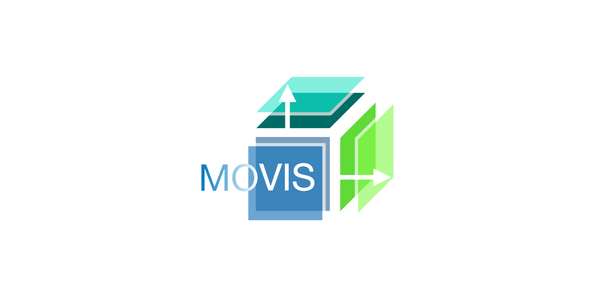

[](https://github.com/AAnzel/MOVIS/actions/workflows/main.yml)


---
# MOVIS

**Exploratory data analysis and visualization tool for time-series multi-omics data sets.**


## Manuscript

This tool is created for the following paper:

***"MOVIS: A Multi-Omics Software Solution for Multi-modal Time-Series Clustering, Embedding, and Visualizing Tasks"*** by Aleksandar Anžel, Dominik Heider, and Georges Hattab

**Paper badge placeholder, link to the PDF placeholder**

Please cite the paper as:
```
Bibtex citation placeholder
```

---
Abstract:

> Thanks to recent advances in sequencing and computational technologies, many researchers with biological and/or medical backgrounds are now producing multiple data sets with an embedded temporal dimension. With various technologies, multiple modalities enable researchers to explore and investigate different biological and physico-chemical processes. Motivated to specifically explore multi-omics data and time-series multi-omics, the exploration process has been hindered by the separation introduced by each omics-type. To effectively explore such temporal data sets, discover anomalies, find patterns, and better understand their intricacies, expertise in computer science and bioinformatics is required. Here we present MOVIS, a modular time-series multi-omics exploration tool with a user-friendly web interface that facilitates the data exploration of such data.  It brings into equal participation each time-series omic-type for analysis and visualization. As of the time of writing, two time-series multi-omics data sets haven been integrated and successfully reproduced. The resulting visualizations are task-specific, reproducible, and publication-ready. MOVIS is built on open-source software and is easily extendable to accommodate different analytical tasks.

**Paper image placeholder**

## Dependancy

The code is written in Python 3.8.11 and tested on Linux with the following libraries installed:

|Library|Version|
|---|---|
|altair|4.1.0|
|altair_saver|0.5.0|
|biopython|1.78|
|gensim|4.0.1|
|numpy|1.20.3|
|pandas|1.3.2|
|scikit-learn|0.24.2|
|scipy|1.6.2|
|streamlit|0.81.1|
|protobuf|3.14.0|
|python-Levenshtein|0.12.2|


## Data
The data used in the **Example 1** comes from the following paper:

> **Integration of time-series meta-omics data reveals how microbial ecosystems respond to disturbance**, Herold, M., Martínez Arbas, S., Narayanasamy, S. et al. Nat Commun 11, 5281(2020).
https://doi.org/10.1038/s41467-020-19006-2.

It is stored at [Data/cached/example_1/](./Data/cached/example_1) in either a raw format or as a [pickle](https://docs.python.org/3/library/pickle.html) object.

The data used in the **Example 2** comes from the following paper:

> **Short- and Long-Term Transcriptomic Responses of Escherichia coli to Biocides: a Systems Analysis**, Merchel Piovesan Pereira, B., Wang, X., & Tagkopoulos, I. (2020). Applied and environmental microbiology, 86(14), e00708-20.
https://doi.org/10.1128/AEM.00708-20.

It is stored at [Data/cached/example_2/](./Data/cached/example_2) in a raw format.


## Code
|Script|Description|
|---|---|
|[Source/](./Source/)|contains all scripts necessary to run the tool.
|[Source/main.py](./Source/main.py)|contains the code that builds the main layout and connects all pages.
|[Source/home.py](./Source/home.py)|contains the code that builds the home page.
|[Source/example_1.py](./Source/example_1.py)|contains the code that builds the example 1 page.
|[Source/example_2.py](./Source/example_2.py)|contains the code that builds the example 2 page.
|[Source/upload.py](./Source/upload.py)|contains the code that builds the upload page.
|[Source/common.py](./Source/common.py)|contains the code with functions shared by all pages.
|[Source/visualize.py](./Source/visualize.py)|contains the code with functions that create various visualizations present in this tool.

## Getting started
Check out our [Wiki page](https://github.com/AAnzel/MOVIS/wiki/0.-Home) for detailed information about MOVIS and how to use it.

## Installation & Running
### Stable
The easiest way to install the tool is to use our latest Docker image:

```
docker pull aanzel/movis:latest
docker run --publish 8501:8501 --detach --name movis aanzel/movis:latest
```


You can start using the tool by opening a web browser and typing in [http://localhost:8501/](http://localhost:8501/) as the address. If you run the docker container, you have to use the IP address or hostname instead of localhost.

### Unstable
*Caution! Use at your own risk!*

You could also clone this repository, build a docker container yourself, and run it locally. This is not recommended as we might introduce unstable features that might not end in the next release of MOVIS. Below is a sequence of instructions (for Linux-based systems) to run the **unstable** version of MOVIS:

```
git clone https://github.com/AAnzel/MOVIS.git
cd MOVIS
docker build -t movis-local:unstable .
docker run --publish 8501:8501 --detach --name movis movis-local:unstable
```

You can start using the tool by opening a web browser and typing in [http://localhost:8501/](http://localhost:8501/) as the address. If you run the docker container, you have to use the IP address or hostname instead of localhost.

## License

Licensed under the GNU General Public License, Version 3.0 ([LICENSE](./LICENSE) or https://www.gnu.org/licenses/gpl-3.0.en.html)

### Contribution

Any contribution intentionally submitted for inclusion in the work by you, shall be licensed under the GNU GPLv3.
